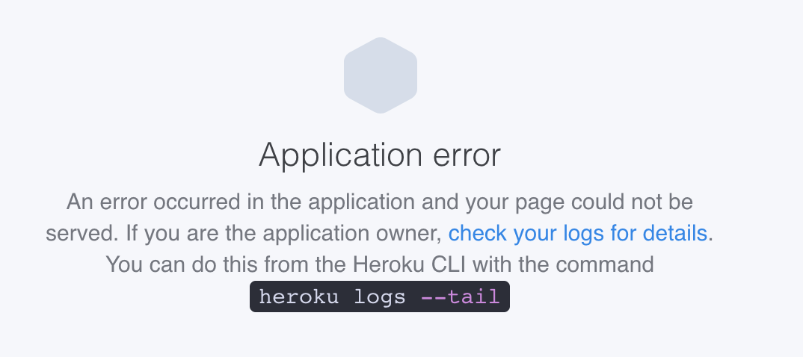

<h1 align="center">Tutorial Heroku</h1>

## Sumário

* ### [Introdução](#intro)

* ### [Visão Geral](#vg)
    
    * #### [Definindo uma Aplicação](#sub1)
    * #### [Definindo o que precisa ser executado](#sub2)
    * #### [Fazendo o Deploy das aplicações](#sub3)
    * #### [Git push Heroku master](#sub4)
    * #### [Construção de Aplicações](#sub5)
    * #### [Como funciona o “dynos”](#sub6)
    * #### [Login e Monitoramento do Site](#sub7)

* ### [Conhecimento Prático](#pratica)
    * #### [Instalando o Heroku](#instalando)
        * ##### [Windows](#windows)
        * ##### [MacOS](#mac)
        * ##### [Linux](#linux)

* #### [Primeiros Passos](#topic1)

* #### [Checando os Logs da aplicação na prática e lidando com erros](#topic2)

* #### [Passo a passo para fazer o primeiro deploy de uma aplicação dash para o Heroku](#topic3)

* ### [Referência](#ref)

* ### [Redes Sociais do ODE](#social-media)


# Introdução <a name="intro"></a>

O Heroku é uma plataforma que permite a hospedagem gratuita e paga de aplicações web, fornecendo todo o cenário necessário para colocar um site na web em várias linguagens de programação, como Python, Ruby, React, etc. Nesse sentido, a sua versão gratuita é muito utilizada para a protetipagem de websites, como é o caso do site do ODE, uma vez que suporta sites de até 500Mb. O funcionamento da hospedagem na versão gratuita é interessante, pois quando o seu site fica inativo(sem visitas) por 30 minutos, o heroku "dorme a máquina"(hiberna) necessária por fazer o seu site funcionar, fazendo com que ele demore um tempo considerável para responder em tais situações, essa é uma das características que permite que o serviço seja gratuito, mas também existem versões pagas em que isso não ocorre.

# Visão Geral <a name="vg"></a>

## Definindo uma aplicação <a name="sub1"></a>

O Heroku permite você fazer o upload, rodar e administrar aplicações feitas nas seguintes linguagens: Ruby, Node.js, Java, Python, Clojure, Scala, Go e PHP. Isso permite que você trabalhe também com frameworks e bibliotecas que combinem mais de uma dessas linguagens. Ele também permite o trabalho com dependências (bibliotecas externas), em python, por exemplo, elas são representadas por um arquivo requirements.txt. Sendo assim, o código da sua aplicação juntamente com o arquivo de dependências fornece informação suficiente para a plataforma do Heroku construir a sua aplicação, produzindo um arquivo que pode ser executado na web.

## Definindo o que precisa ser executado <a name="sub2"></a>

Com o Heroku, você não precisa fazer muitas modificações na sua aplicação para submetê-la. Algo obrigatório que deve ser explicitado é a plataforma que as partes do seu arquivo são executadas. No entanto, se você estiver usando um framework instável, o Heroku consegue descobrir, no caso dos frameworks em python: em Dash, por exemplo, é o arquivo python app.py; já em Django, é o python <app>/manage.py. Todavia, quando isso não acontecer, você precisa declarar explicitamente o que deve ser executado, para fazer isso você utiliza um arquivo chamado Procfile, em que a sua primeira linha deve declarar que o tipo de comando deve ser web e o que precisa ser executado, além de um processo, com o seu comando correspondente. No caso anterior, o próprio Heroku faz isso de forma automatizada. O arquivo Profcfile explicita a arquitetura dda sua aplicação, o que permite a você escalar cada parte independentemente.  

## Fazendo o Deploy das aplicações <a name="sub3"></a>

Como foi visto no tutorial do GitHub, ele é um controle de versão poderoso utilizado por vários desenvolvedores para administrar o versionamento de seus códigos. Quando a sua aplicação Heroku é criada, ele é associado um novo “Git remote”, normalmente com o nome Heroku, associado com o repositório git da sua aplicação. Dessa forma, para fazer o deploy do seu código se usa o comando git push, utilizando o prefixo Heroku ao invés de remote.

## Git push Heroku master <a name="sub4"></a>

É importante ressaltar, porém que existe uma conexão direta entre o GitHub e o Heroku em que cada novo pull request é associado a sua nova aplicação, habilitando vários cenários de integração com o Heroku. Outra opção é usar a Heroku API para construir esses modelos.

## Construção de Aplicações <a name="sub5"></a>

Quando o sistema de build to Heroku recebe uma aplicação, é realizada a construção do modelo de execução, variando de acordo com a linguagem utilizada, mas que serve o mesmo padrão: obtendo as dependências explicitadas no arquivo (no caso do Python, é o requirements.txt) e criando alguns arquivos de suporte necessários como o código de compilação, e combinando tudo isso em um “slug” (pacote) de execução. Eles são um aspecto fundamental do que acontece durante a execução da aplicação, contendo a sua compilação, mutuamente com os arquivos de apoio, tudo isso prontos para serem executados juntos com as instruções (contidas no arquivo Procfile). 

## Como funciona o “dynos” <a name="sub6"></a>

O Heroku executa as aplicações de acordo com os comandos explicitados no arquivo Procfile, como dito anteriormente. O Dyno é um container em formato Unix, que fornece, a nível de sistema, o que é necessário para fazer a aplicação funcionar, sendo vários deles para uma mesma aplicação, eles são feitos utilizando o slug(pacote) preparado. Basicamente o dyno é um arquivo de sistema (leve) que é iniciado para carregar o site, algo parecido com sistemas operacionais. 

Normalmente, quando é a primeira vez que você faz um deploy, O Heroku inicializa automaticamente 1 web dyno. Quando esse dyno é iniciado, ele é carregado junto com os pacotes de informação do código fonte do seu site, finalizando com a execução do processo web discriminado no Procfile (já explicado anteriormente). Sendo assim, quando você faz o deploy de uma nova versão do site, um novo dynos é criado (e os antigos são excluídos) substituindo as antigos. O heroku permite a visualização dessas informações através do comando:
```heroku ps```

## Login e Monitoramento do Site <a name="sub7"></a>
O heroku fornece as informações do site sequencialmente de acordo com os registros de data e hora dos eventos que vão ocorrendo. <strong>Isso é importante para ver quando há um erro no site, por exemplo</strong>. 


# Conhecimento prático <a name="pratica"></a>

## Instalando o Heroku <a name="instalando"></a>

### Windows <a name="windows"></a>
Para fazer a instalação do Heroku basta ir até o site: <a src="https://devcenter.heroku.com/articles/heroku-cli#download-and-install">clique aqui</a> e selecionar o instalador de acordo com o seu sistema operacional. No momento de instação, lembre de manter a opção de instalar no PATH habilitada, assim você também pode utilizar o Heroku direto do seu terminal windows.

### MacOS <a name="mac"></a>
A Heroku recomenda a instalação direto do terminal para o MacOS através do comando ```brew tap heroku/brew && brew install heroku```

### Linux  <a name="linux"></a>
Para o Linux Ubuntu, a Heroku recomenda a instalação através do terminal, através do comando ```sudo snap install --classic heroku```. Porém, no site <a src="https://devcenter.heroku.com/articles/heroku-cli#download-and-install">clique aqui</a> é possível encontrar o método de instalação para as mais diversas distribuições.


## Primeiros Passos <a name="topic1"></a>

Para fazer o login na sua conta Heroku utilize o comando ```heroku login``` no seu terminal (MacOS/Linux) ou no cmd (windows) nesse caso você será redirecionado ao browser para realizar o login. Outra forma de fazer isso é através do comando ```heroku login -i``` nesse caso você consegue inserir as informações de login direto no terminal.

## Checando os Logs da aplicação na prática e lidando com erros <a name="topic2"></a>

Algumas vezes acabando fazendo modificações erradas no repositório que nos provocam o erro abaixo:

<p align="center">
    
</p>

Nesses casos, você deve proceder da seguinte forma:
(1) verificar os logs da sua aplicação no Heroku através do terminal através do comando ```heroku logs --app NomeDaAPP --tail```
    - encontrar o erro a partir dessa verificação

(2) Resolver o erro no código (no repositório) e fazer um novo deploy para verificação;

(3) Se der erro novamente, repita o processo.

(4) Caso isso não funcione, tente observar os demais tipos de logs do seu website, para saber mais digite o seguinte comando no terminal: ```heroku logs --help```.

Confere o vídeo abaixo que te explicamos isso na prática!

[](https://youtu.be/qpmOPcIMM_A)
| [Clique aqui para acessar o vídeo](https://youtu.be/qpmOPcIMM_A "obrigatorio") |

Clique [aqui](https://devcenter.heroku.com/articles/logging) caso deseje obter mais informações no site oficial do heroku.

## Passo a passo para fazer o primeiro deploy de uma aplicação dash para o Heroku <a name="topic3"></a>

O processo de deploy é um pouco complicado na primeira vez, porém uma vez realizado torna-se bem mais simples atualizar a aplicação (realizar novos deploys). Confere o vídeo abaixo que te explicamos como fazer esse processo de forma descomplicada.

VIDEO YASMIN


# Referência utilizada <a name="ref"></a>

- [Como funciona o Heroku](https://devcenter.heroku.com/articles/how-heroku-works)
- [Fazendo o deploy da sua primeira aplicação](https://towardsdatascience.com/deploying-your-dash-app-to-heroku-the-magical-guide-39bd6a0c586c#:~:text=Create%20Heroku%20app%20linked%20to,%E2%80%9Cgit%20push%20Heroku%20main%E2%80%9D)
- [Logs no Heroku](https://devcenter.heroku.com/articles/logging)


### visite as nossas redes sociais: <a name="social-media"></a>

[](https://github.com/ODEUFPB/) 
[](https://www.instagram.com/extensaocear/) 


